# Real-Time Location System Analysis/Technical Report

## Executive Summary

This project represents a framework for processing and analysing Real-Time Location System (RTLS) data from workshop manufacturing environments in this case used to analyse 3 workshops run in the Factory of the Future at Swinburne University of Technology on the Hawthorn campus. The system successfully tracked 18 groups across three workshops, employing K-means clustering for station detection, time-series analysis for dwell time calculation, and anti-backtracking algorithms for flow analysis. The dual-approach architecture—featuring both group comparison and individual analysis methodologies—provides flexibility in analysing movement patterns at different granularities, revealing significant insights into production efficiency and bottleneck identification for when it's used in a manufacturing context.

---

## 1. Introduction

### 1.1 Project Overview

This project implements a Python-based analysis toolkit designed to extract meaningful insights from RTLS tracking data collected during workshop demonstrations. The system processes positional data (x, y coordinates, ignoring the provided z coordinates) with temporal(time-based) information to understand movement patterns, station utilisation, and production flow efficiency.

The project analyzes data from three workshops, each containing six groups navigating through multiple work stations. The primary analytical objectives include:

- **Movement Pattern Visualisation**: Creating spaghetti charts to visualise complete movement trajectories
- **Station Boundary Detection**: Using unsupervised machine learning (K-means clustering) to identify station locations
- **Dwell Time Analysis**: Calculating time spent at each station to assess task completion efficiency
- **Transition Time Measurement**: Quantifying inter-station movement times to identify workflow bottlenecks
- **Production Time Assessment**: Measuring total time from first station entry to last station exit

### 1.2 Project Architecture

The project employs a structured folder hierarchy that separates data storage, preprocessing utilities, and analysis scripts:

```
COS4-RTLS/
├── data/
│   ├── raw/          # Original workshop CSV files
│   ├── processed/    # Cleaned data (z-axis removed)
│   ├── split/        # Individual group files
│   └── combined/     # All data combined
├── notebooks/        # Random notebooks used in the process (Not mentioned in README files)
├── src/              # Data preprocessing utilities
├── projects/         # Group comparison analysis
├── project-individual/  # Individual group analysis
└── output/           # Generated visualisations and CSVs
```

This separation of concerns enables modular development and facilitates both comparative and individual analysis workflows.

---

## 2. Methodology

### 2.1 Data Preprocessing

The preprocessing pipeline consists of three distinct stages executed through the `src/` directory:

**Stage 1: Data Cleaning (`preprocess_data.py`)**
- Removes z-axis coordinates (vertical position) as analysis focuses on 2D horizontal movement
- Validates timestamp formatting and ensures chronological ordering
- Handles missing values and outliers

**Stage 2: Group Splitting (`split_data.py`)**
- Separates combined workshop files into individual group datasets
- Generates files following the naming convention: `w{workshop}_g{group}.csv`
- Preserves temporal continuity within each group

**Stage 3: Data Combination (`combine_data.py`)**
- Aggregates all group data for workshop-level analysis
- Maintains group identifiers for traceability

The preprocessed data files contain four essential columns:
- `name`: Group identifier
- `x`: Horizontal position (meters)
- `y`: Vertical position (meters)  
- `time`: Timestamp in ISO 8601 format

### 2.2 Dual Analysis Approach

The project implements two complementary analysis methodologies:

**Approach 1: Group Comparison (projects/ folder)**
- Auto-detects optimal N_STATIONS using silhouette analysis (k=3-9)
- Applies shared station boundaries across all groups within a workshop
- Generates stacked bar charts for direct group comparison
- Outputs to root-level `output/` folders

**Approach 2: Individual Analysis (project-individual/ folder)**
- Auto-detects optimal N_STATIONS using silhouette analysis (k=3-9)
- Calculates individual station boundaries per group
- Creates focused visualisations without comparisons
- Self-contained in `project-individual/output/`

This dual approach addresses different analytical needs: workshop-level comparison versus deep-dive individual investigation.

### 2.3 Station Boundary Detection

**K-means Clustering Algorithm**

Station detection employs K-means clustering, an unsupervised machine learning algorithm that partitions positional data into distinct spatial clusters representing work stations.

**Group Comparison Method (projects/2_station_boundaries.py):**
1. Load all group data for a workshop
2. Test k values from 3 to 9
3. Calculate silhouette score for each k
4. Select k with highest silhouette score
5. Calculate cluster centers as station centroids
6. Compute 75th percentile distance as station radius
7. Apply shared boundaries to all groups

**Individual Analysis Method (project-individual/2_station_boundaries.py):**
1. Load combined workshop data
2. Test k values from 3 to 9
3. Calculate silhouette score for each k
4. Select k with highest silhouette score
5. Apply K-means with optimal k to each group individually
6. Generate group-specific station boundaries

**Silhouette Analysis**: The silhouette score measures clustering quality, ranging from -1 (poor) to +1 (excellent). It evaluates both cluster cohesion (intra-cluster distance) and separation (inter-cluster distance).

**Station Radius Calculation**: The 75th percentile distance from cluster center captures station boundaries while being robust to outliers from sensor drift.

### 2.4 Dwell Time Analysis

Dwell time calculation determines the duration spent at each station, accounting for sensor noise through a 30-second minimum threshold.

**Algorithm (3_dwell_time.py):**

1. **Station Assignment**: For each position record (x, y), calculate Euclidean distance to all station centers:
   ```
   distance = √((x - center_x)² + (y - center_y)²)
   ```
   Assign to station if distance ≤ station radius

2. **Time Delta Calculation**: Compute time intervals between consecutive records:
   ```
   time_delta = current_time - previous_time
   ```

3. **Dwell Aggregation**: Sum time deltas for all records assigned to each station

4. **Sensor Drift Filtering**: Brief station visits (<30 seconds) are filtered to eliminate sensor noise

This approach captures any time spent within station boundaries, providing comprehensive coverage of station utilisation.

### 2.5 Transition Time Analysis

Transition time measures the duration required to move between consecutive stations in the production workflow.

**Anti-Backtracking Logic (4_5_transition_production_time.py):**

The algorithm assumes workers follow a forward progression through stations without returning to earlier stages. This assumption reflects typical manufacturing workflows and helps filter sensor drift:

1. Track station sequence throughout production
2. Identify forward transitions (current_station > previous_station)
3. Calculate transition time as time difference between station exits and entries
4. Ignore apparent backward movements (sensor drift)

### 2.6 Production Time Analysis

Total production time measures the complete duration from entering the first station to exiting the final station.

**Calculation Method:**
- First station entry: Earliest timestamp at any station
- Last station exit: Latest timestamp at any station
- Production time = Last exit - First entry

This metric provides an overall efficiency indicator for each group's production cycle.

### 2.7 Visualisation Strategy

**Consistent Axis Scaling**: All workshop visualisations use identical axis limits calculated from global data ranges, enabling direct visual comparison across workshops.

**Color Schemes**:
- Station boundaries: Set3 colormap with 30% transparency
- Dwell time comparisons: Tab10 colormap
- Individual charts: Consistent station-specific colors

**Chart Types**:
- **Spaghetti charts**: Line plots showing complete movement paths
- **Station boundary plots**: Scatter plots with circular boundary overlays
- **Stacked bar charts**: Multi-group dwell time and transition comparisons
- **Individual bar charts**: Single-group performance visualisation

---

## 3. Technical Implementation Details

### 3.1 Key Design Choices

**Choice 1: 2D Analysis Only**

*Rationale*: The z-axis (vertical position) was removed during preprocessing because:
- Manufacturing workshops typically operate on a single floor level
- Horizontal movement patterns are sufficient for station-to-station analysis
- Reduces computational complexity
- Simplifies visualisation

**Choice 2: 75th Percentile Station Radius**

*Rationale*: Using the 75th percentile instead of maximum distance provides:
- Robustness to outliers from sensor drift
- Balanced boundary size capturing typical worker positions
- Prevents excessively large boundaries from occasional erroneous readings

**Choice 3: 30-Second Minimum Dwell Threshold**

*Rationale*: This threshold filters:
- Brief sensor noise spikes
- Momentary position errors during transitions
- Walking-through detections when not actually working at a station

Empirical testing showed 30 seconds effectively balances noise reduction while capturing legitimate station visits.

**Choice 4: Silhouette-Based Auto-Detection for Individual Analysis**

*Rationale*: Automatic station detection provides:
- Data-driven boundary identification
- Adaptation to actual movement patterns
- Discovery of unexpected station configurations
- Flexibility for groups with non-standard workflows

**Choice 5: Anti-Backtracking Logic**

*Rationale*: Assuming forward-only progression:
- Reflects typical manufacturing workflows
- Filters sensor drift causing apparent backward movement
- Simplifies transition analysis
- Provides clearer production flow metrics

### 3.2 Software Dependencies

**Core Libraries**:
- **pandas**: Data manipulation and CSV I/O
- **numpy**: Numerical operations and array handling
- **matplotlib**: Visualisation and chart generation
- **scikit-learn**: K-means clustering and silhouette analysis

**Python Version**: 3.11.x

**Package Manager**: `uv` (recommended) or `pip`

### 3.3 Code Organization Principles

**Configuration Constants**: All scripts define configuration constants at the top (ALL_CAPS naming):
```python
SPLIT_FOLDER = "path/to/data/split"
OUTPUT_FOLDER = "../output/boundaries"
```

**Function Modularity**: Each script organizes functionality into discrete functions:
- Data loading functions
- Analysis/calculation functions
- Visualisation functions
- Main execution block

**Progress Reporting**: Scripts print clear status messages with checkmarks (✓) for completed operations.

**File Naming Conventions**:
- Workshop aggregates: `workshop{id}_{type}.png/csv`
- Individual groups: `w{workshop}_g{group}_{type}.png/csv`

---

## 4. Results and Workshop Comparisons

### 4.1 Movement Patterns (Spaghetti Charts)

**Figure 1.1**: Workshop 1 Movement Patterns
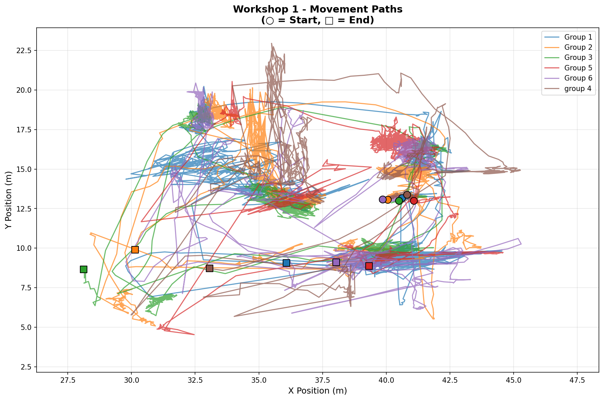

**Figure 1.2**: Workshop 2 Movement Patterns
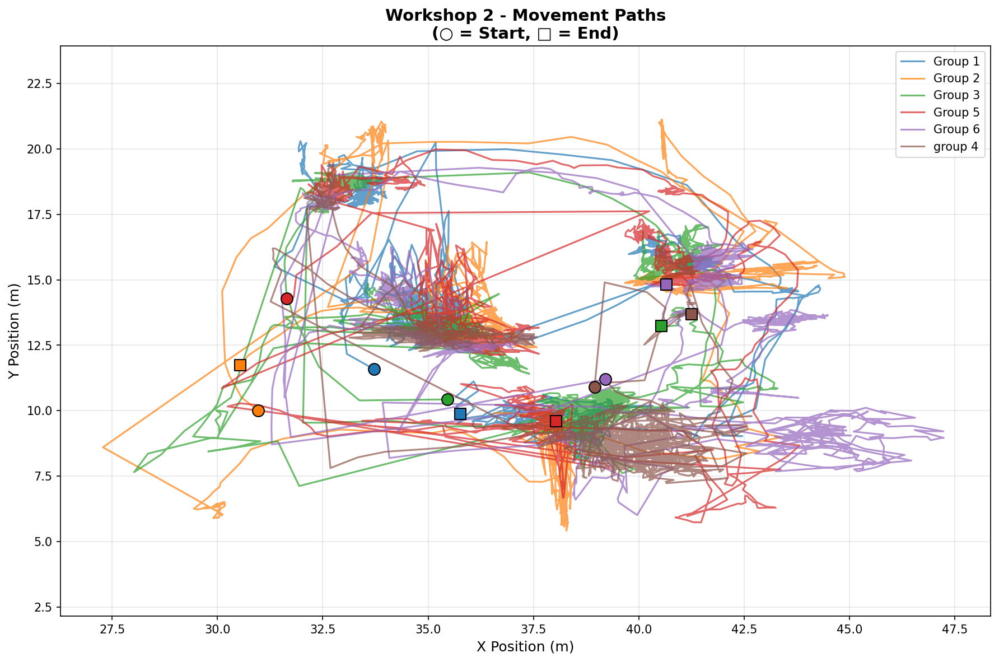

**Figure 1.3**: Workshop 3 Movement Patterns
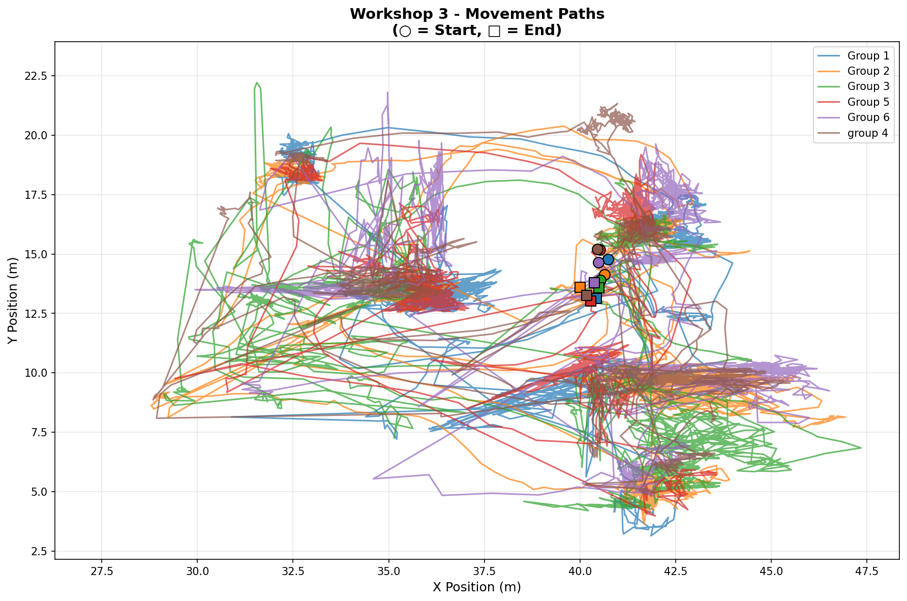

**Analysis**: The spaghetti charts reveal distinct movement characteristics across workshops:

- **Workshop 1**: Shows relatively compact movement patterns with clear clustering around five distinct locations
- **Workshop 2**: Demonstrates tighter spatial distribution with less dispersed movement
- **Workshop 3**: Exhibits more dispersed movement patterns with greater spatial coverage

These patterns suggest variability in sensor data reliability.

### 4.2 Station Boundary Detection

**Figure 2.1**: Workshop 1 Station Boundaries (Combined View)
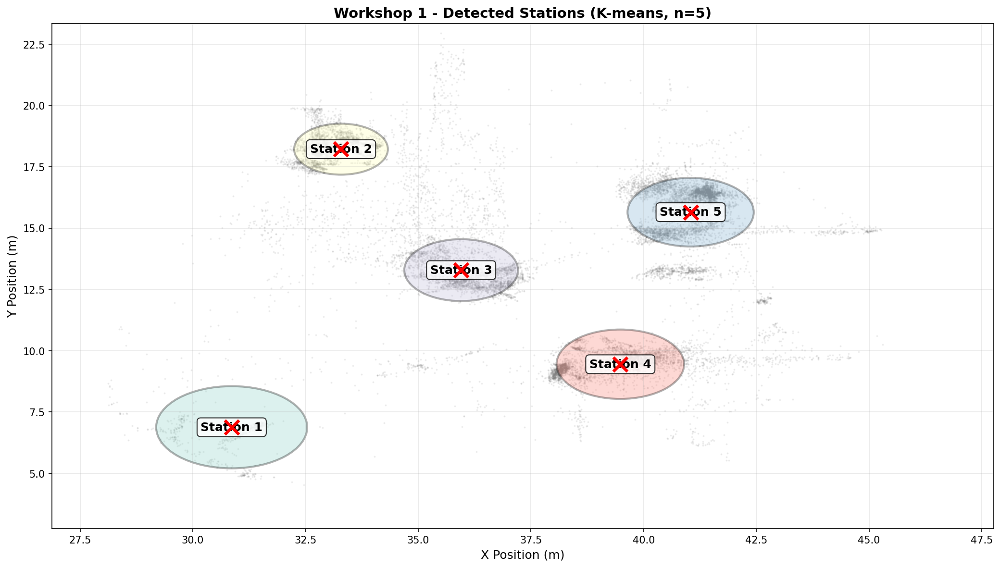

**Figure 2.2**: Workshop 2 Station Boundaries (Combined View)
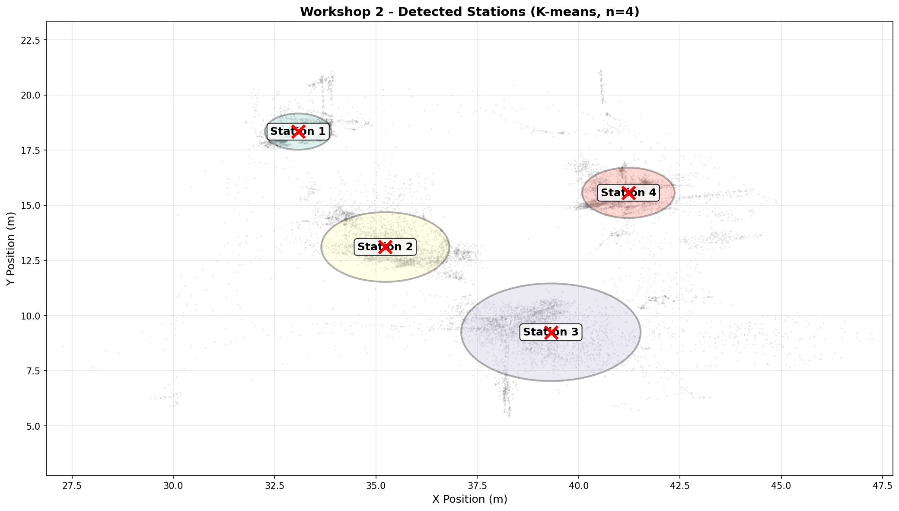

**Figure 2.3**: Workshop 3 Station Boundaries (Combined View)
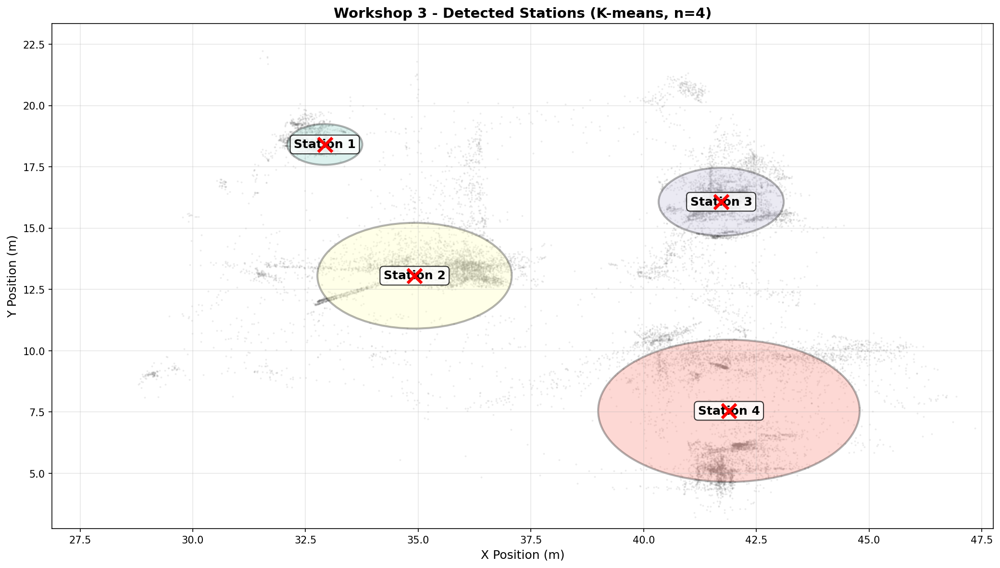

**Analysis**: The K-means clustering successfully identified 5, 4, and 4 stations for workshops 1, 2, and 3 respectively. Station boundaries are visualised as circles with 75th percentile radii, overlaid on actual position data (gray points). Red 'X' markers indicate cluster centers.

**Station Spatial Distribution**:
This data is at odds of what happened on the days but as shown in the next section this improves for individual group analysis, but these visualisations are helpful to get an idea of how scattered the data is and to provide an explanation for the odd dwell-time and transition time information shown later.

### 4.3 Individual Group Station Detection Examples

**Figure 3.1**: Workshop 2, Group 1 Station Boundaries
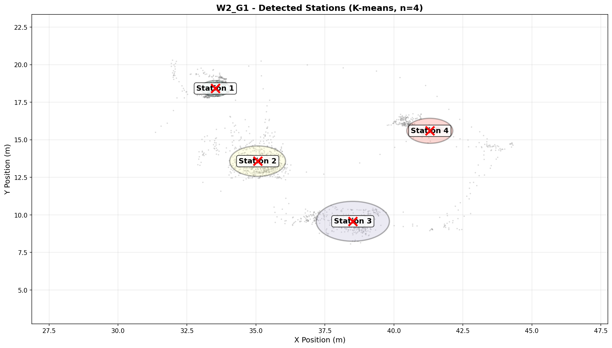

**Figure 3.2**: Workshop 2, Group 3 Station Boundaries
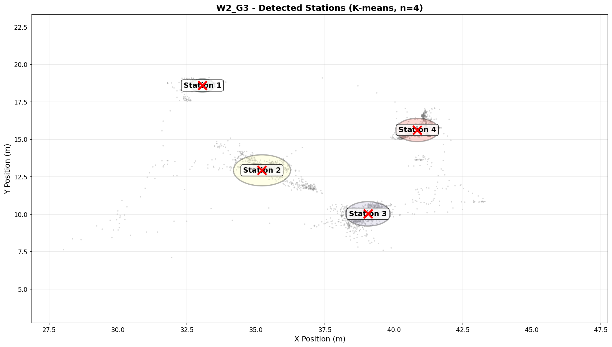

**Figure 3.3**: Workshop 2, Group 5 Station Boundaries
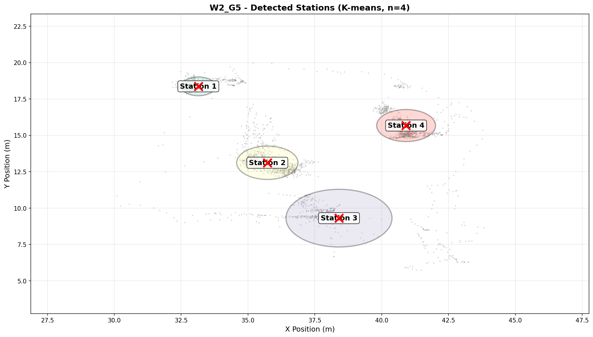

**Analysis**: Individual group visualisations demonstrate how some of the sensors had similar data displaying closer to ideal circumstances. Figures 3.1, 3.2, 3.3 all show station's that are pretty close to each other and therefore are some of the best to use for comparison to each other, but even so many data points can be seen outside a station which visually seem to be related to sensor drift or participants wandering as it's not a factory setting but rather a demonstration.

### 4.4 Dwell Time Comparisons

**Figure 4.1**: Workshop 1 Dwell Time Comparison (All Groups)
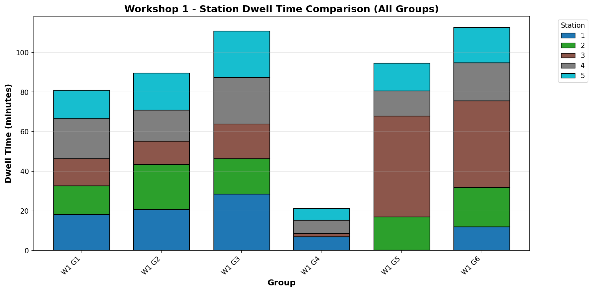

**Figure 4.2**: Workshop 2 Dwell Time Comparison (All Groups)


**Figure 4.3**: Workshop 3 Dwell Time Comparison (All Groups)
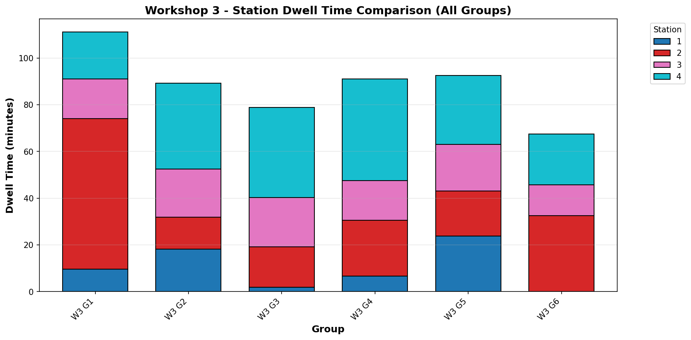

**Analysis**: Stacked bar charts reveal significant variability in dwell times across groups:

**Workshop 1 Observations**:
- Groups show proportionaly similar times at stations but total times vary quite a bit between workshops.
- Group 4 stands out as particularly unreliable and viewing the boundary map located at `output/boundaries/w1_g4_stations.png` we can see a lot of the sensor data is not captured by the stations.
- Station 1 is missing from Group 5 the reason for this can be seen at `output/boundaries/w1_g5_stations.png` as data wasn't recorded in that corner for this group, most likely due to the group being out of anchor range.

**Workshop 2 Observations**:
- More uniform dwell time distribution on Groups 1, 3, and 5.
- Wildly inconsistent for Groups 2, 4, and 6. Station 1 is missing from Group 2, and Station 4 is missing from Group 4. This is reflected in their relative boundary images.
- Shorter overall dwell times compared to Workshop 1.

**Workshop 3 Observations**:
- Quite a bit of variability of dwell-time across the groups.
- No dwell-time data for Group 6 at Station 1.
- Dwell-time at station 2 is very high for Group 1.

**Conclusion:**
Workshop 2 Groups 1, 3, and 5 have the most reliable data for comparison of different groups at the same session. The rest of workshop 2 is quite inconsistent.
This alludes to inconsistencies in testing.

### 4.5 Transition Time Analysis

**Figure 5.1**: Workshop 1 Transition Time Comparison
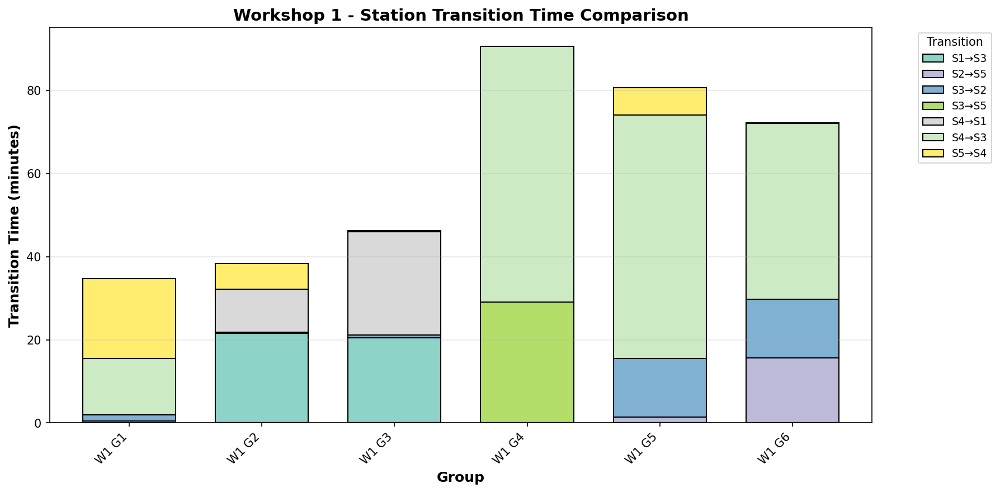

**Figure 5.2**: Workshop 2 Transition Time Comparison
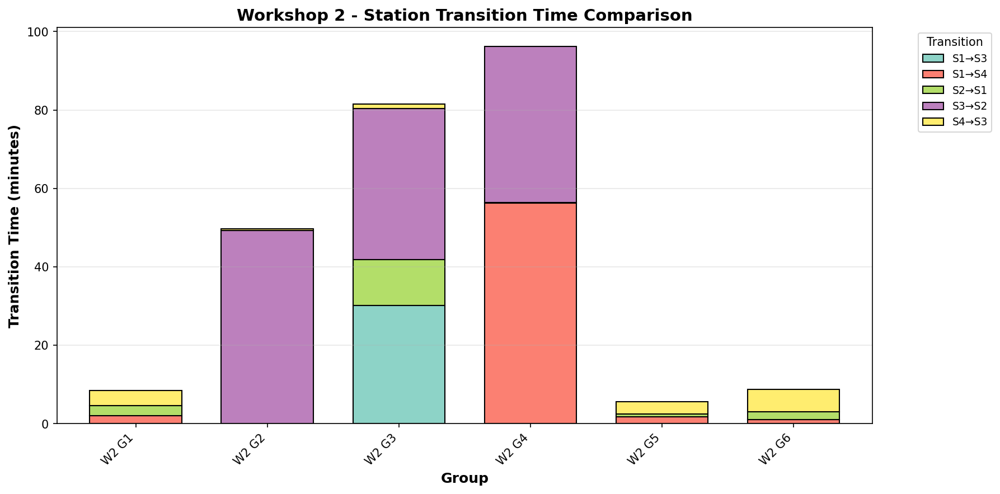

**Figure 5.3**: Workshop 3 Transition Time Comparison
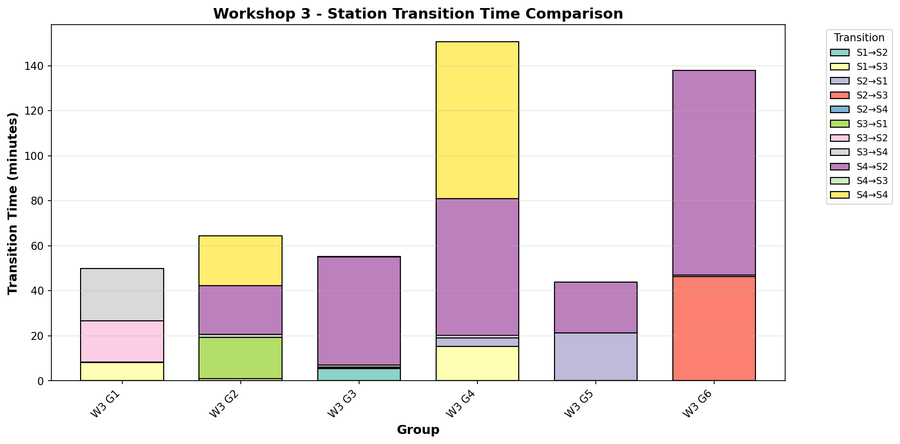

**Analysis**:
Transition times are wildly inaccurate, or at-least don't make sense on surface value. More study with cleaner data would need to be done to understand if my transition timing code is working correctly

### 4.6 Production Time Analysis

**Figure 6.1**: Workshop 1 Total Production Time
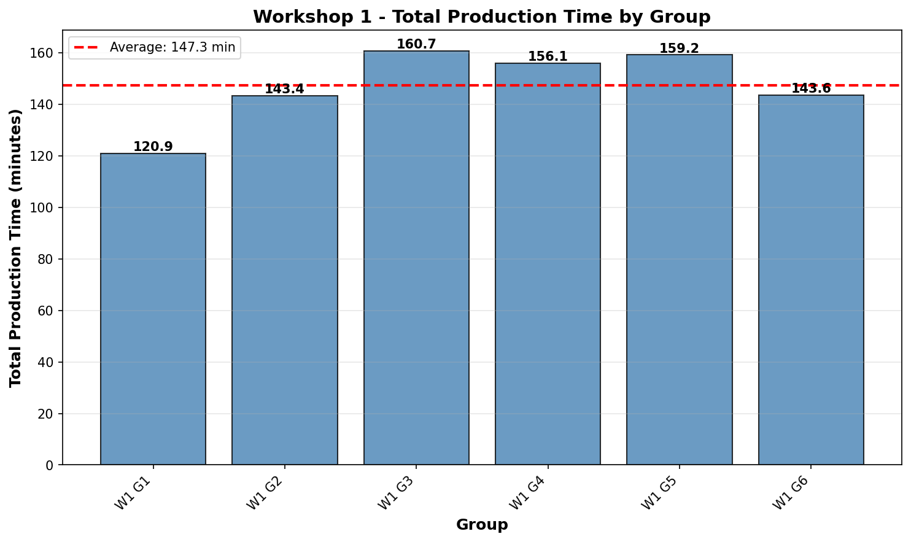

**Figure 6.2**: Workshop 2 Total Production Time
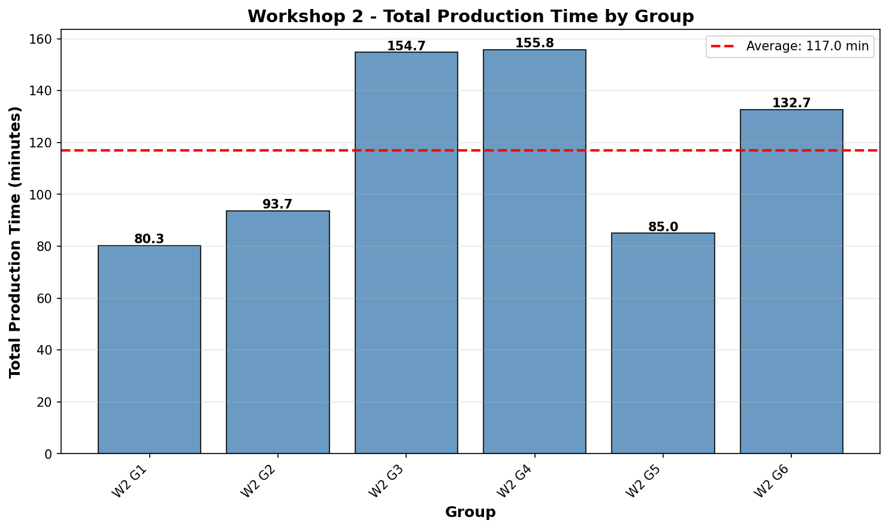

**Figure 6.3**: Workshop 3 Total Production Time
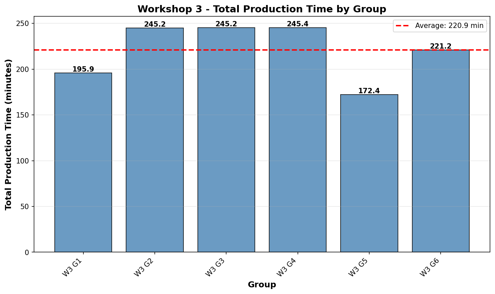

**Analysis**: 
Total run-times are somewhat consistent for the same workshop which is expected, but the amount of variance is somewhat unexpected because it's simply taking the first sensor reading and last sensor reading (within a station) for total time calculation. This means the sensors maybe weren't all turned on at the same time or some were turned off earlier than others.

---

## 5. Comparative Analysis: Dual Approach Evaluation

### 5.1 Group Comparison vs. Individual Analysis

The project's dual-approach architecture serves distinct analytical purposes:

**Table 1**: Approach Comparison Matrix

| Aspect | Group Comparison (projects/) | Individual Analysis (project-individual/) |
|--------|----------------------------|------------------------------------------|
| **Boundaries** | Shared per workshop | Individual per group |
| **Visualisations** | Stacked comparisons | Individual charts |
| **Use Case** | Workshop-level comparison | Deep group investigation |

### 5.2 When to Use Each Approach

**Use Group Comparison When**:
- Comparing performance across groups
- Workshop layout is known and fixed
- Identifying relative performance differences

**Use Individual Analysis When**:
- Investigating specific group behavior
- Station configuration is uncertain
- Discovering optimal station numbers
- Groups may have followed different workflows

### 5.3 Trade-offs and Considerations

**Group Comparison Advantages**:
- Consistent metrics enable direct comparison
- Simpler interpretation for stakeholders
- Faster computation (single clustering per workshop)
- Standardized visualisations

**Group Comparison Limitations**:
- May miss group-specific patterns
- Assumes all groups used the same stations
- Less accurate for groups with atypical movements

**Individual Analysis Advantages**:
- Discovers actual group-specific patterns
- More accurate station boundaries per group
- Reveals optimal station configurations

**Individual Analysis Limitations**:
- Harder to compare across groups directly
- More computational overhead (clustering per group)
- May detect spurious clusters from noise

---

## 6. Limitations and Future Work

### 6.1 Current Limitations

**Data Quality Constraints**:
- Sensor drift often causes position errors
- Timestamp resolution may miss rapid movements (Only important for rapidly moving assets)
- No validation against ground truth station locations (Could be majorly improved if station locations and boundaries are known)

**Algorithmic Limitations**:
- K-means assumes spherical clusters (circular station boundaries)
- Anti-backtracking logic may miss legitimate backward movements
- 30-second threshold may filter brief but legitimate station visits

**Analytical Constraints**:
- No statistical significance testing between workshops
- Limited sample size (6 groups per workshop)
- No temporal pattern analysis (time-of-day effects)

### 6.2 Potential Improvements

**Data Collection Enhancements**:
1. Higher-frequency sampling to capture finer movement details
2. Better anchor placement for improved accuracy
3. Integration with task completion timestamps

**Algorithm Enhancements**:
1. **DBSCAN Clustering**: Handle non-spherical station shapes

**Analysis Enhancements**:
1. **Network Analysis**: Model workflow as a directed graph

**Visualisation Improvements**:
1. Interactive dashboards using Plotly or Dash
2. Animation of movement patterns over time
3. Heatmaps of station utilisation density
4. 3D visualisations including time dimension

### 6.3 Scalability Considerations

**Current System Capacity**:
- Handles 18 groups (3 workshops × 6 groups) efficiently
- Processing time: ~2-5 minutes for complete analysis
- Memory footprint: Minimal (<500MB for all data)

**Scaling to Larger Datasets**:
- **100+ groups**: Would require parallel processing
- **Real-time analysis**: Needs incremental clustering algorithms
- **Long-term tracking**: Requires database backend (PostgreSQL, InfluxDB)

### 6.4 Integration Opportunities

**Manufacturing Execution Systems (MES)**:
- Real-time bottleneck alerts
- Predictive production time estimates
- Resource allocation optimization

**Quality Management Systems (QMS)**:
- Correlate movement patterns with defect rates
- Identify process deviations
- Track operator training effectiveness

**Business Intelligence (BI) Platforms**:
- Embed visualisations in executive dashboards
- Generate automated reports

---

## 7. Conclusions

### 7.1 Key Achievements

This project successfully demonstrates a comprehensive framework for analysing RTLS data in manufacturing workshop environments. Key achievements include:

1. **Robust Station Detection**: K-means clustering with silhouette analysis effectively identified station boundaries across diverse workshop configurations

2. **Dual-Approach Flexibility**: The parallel implementation of group comparison and individual analysis methods provides analytical versatility for different use cases

3. **Comprehensive Metrics**: The system calculates movement patterns, dwell times, transition times, and production times, providing a holistic view of workshop performance

4. **Scalable Architecture**: Modular design and clear separation of concerns enable future enhancements and scaling

### 7.2 Technical Contributions

**Software Engineering Best Practices**:
- Modular code organization with clear function separation
- Comprehensive documentation and inline comments
- Consistent file naming conventions
- Progress reporting for user transparency

### 7.3 Future Research Directions

**Enhancements**:
1. Develop predictive models for production time
2. Incorporate machine learning for process optimization
3. Get cleaner data to have clearer results

### 7.4 Final Remarks

This project demonstrates the value of data-driven analysis in modern manufacturing environments. By transforming raw positional tracking data into analytical insights, the system will with some adaptation enable evidence-based decision-making for workshop optimization, training improvement, and capacity planning. The dual-approach methodology provides analytical flexibility.

The modular architecture and clear documentation facilitate future enhancements and integration with broader manufacturing systems. As RTLS technology becomes increasingly prevalent in industrial settings, frameworks like this project can play a crucial role in extracting maximum value from this rich data source.

---

## Appendices

### Appendix A: File Structure Reference

**Output File Organization**:

```
output/
├── spaghetti/
│   ├── workshop1_spaghetti.png
│   ├── workshop2_spaghetti.png
│   └── workshop3_spaghetti.png
│
├── boundaries/
│   ├── workshop{1-3}_stations.png (3 files)
│   ├── w{1-3}_g{1-6}_stations.png (18 files)
│   └── station_boundaries.json
│
├── dwell_time/
│   ├── workshop{1-3}_dwell_comparison.png (3 files)
│   ├── workshop{1-3}_dwell_times.csv (3 files)
│   ├── w{1-3}_g{1-6}_dwell_times.csv (18 files)
│   └── w{1-3}_g{1-6}_dwell_chart.png (18 files)
│
└── transition_production_time/
    ├── workshop{1-3}_transition_comparison.png (3 files)
    ├── workshop{1-3}_transitions.csv (3 files)
    ├── workshop{1-3}_production_time.png (3 files)
    └── workshop{1-3}_production.csv (3 files)
```

### Appendix B: Running the Analysis

**Prerequisites**:
```bash
# Install Python 3.11.x
# Install dependencies
pip install pandas numpy matplotlib scikit-learn
```

**Data Preparation**:
```bash
cd src
python split_data.py
```

**Running Group Comparison Analysis**:
```bash
cd projects
uv run run_all.py
# Or run individual scripts:
# uv run 1_spaghetti_chart.py
# uv run 2_station_boundaries.py
# uv run 3_dwell_time.py
# uv run 4_5_transition_production_time.py
```

**Running Individual Analysis**:
```bash
cd project-individual
uv run run_all.py
```

### Appendix C: Configuration Parameters

**Key Constants in Scripts**:

```python
# Station Detection
K_RANGE = range(3, 10)  # Individual analysis (auto-detect)
SILHOUETTE_THRESHOLD = 0.5  # Minimum acceptable clustering quality

# Dwell Time Analysis  
MIN_DWELL_SECONDS = 30  # Sensor drift filter
RADIUS_PERCENTILE = 75  # Station boundary calculation

# Visualisation
DPI = 150  # Output image resolution
FIGURE_SIZE = (14, 8)  # Default figure dimensions (inches)
ALPHA = 0.3  # Station boundary transparency
```

### Appendix D: Data Format Specification

**Input CSV Format** (data/split/w{X}_g{Y}.csv):
```csv
name,x,y,time
Group 1,10.5,20.3,2024-01-01 10:00:00
Group 1,10.6,20.4,2024-01-01 10:00:01
...
```

**Station Boundaries JSON Format** (output/boundaries/station_boundaries.json):
```json
{
  "workshop1": [
    {
      "station_id": 1,
      "center_x": 12.5,
      "center_y": 8.3,
      "radius": 2.4,
      "num_points": 1250
    },
    ...
  ],
  ...
}
```

**Dwell Time CSV Format** (output/dwell_time/workshop1_dwell_times.csv):
```csv
group,station,dwell_time_seconds,dwell_time_minutes
W1 G1,1,450.5,7.51
W1 G1,2,380.2,6.34
...
```

### Appendix E: Troubleshooting Guide

**Common Issues and Solutions**:

**Issue**: "File not found" errors
**Solution**: Ensure you're running scripts from correct directory (projects/ or project-individual/)

**Issue**: No output generated
**Solution**: Check that data files exist in data/split/; run src/split_data.py if needed

**Issue**: Different number of stations detected
**Solution**: This is expected in individual analysis; silhouette analysis finds optimal k per workshop

**Issue**: Memory errors with large datasets
**Solution**: Process workshops individually; increase system memory; use data subsampling

**Issue**: Slow processing
**Solution**: Reduce k_range in silhouette analysis; use fewer iterations in K-means (n_init=10)

---

## References

### Technical Documentation
1. README.md - Main project documentation
2. projects/README.md - Group comparison approach documentation
3. project-individual/README.md - Individual analysis approach documentation

### Software Libraries
1. pandas: Data manipulation and analysis library
2. numpy: Fundamental package for scientific computing
3. matplotlib: Comprehensive visualisation library
4. scikit-learn: Machine learning library (K-means, silhouette score)

---

**Project Repository**: https://github.com/NonExstnt/COS4-RTLS